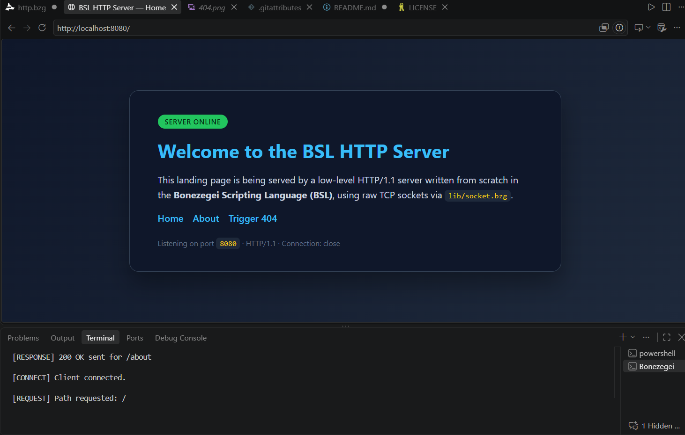
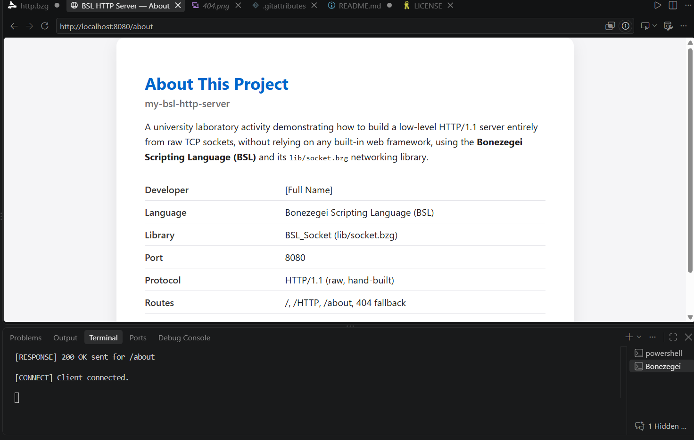
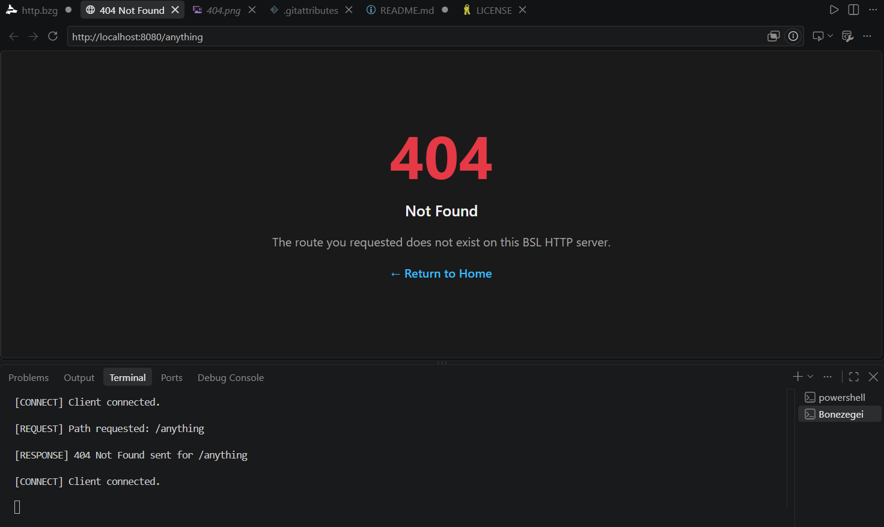
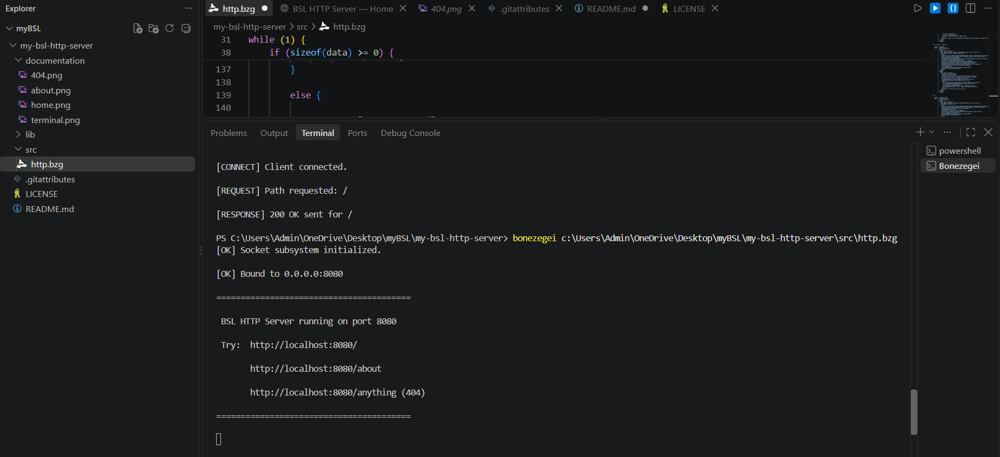

# my-bsl-http-server

A low-level, procedural **HTTP/1.1 server** built from raw TCP sockets in the **Bonezegei Scripting Language (BSL)**, using the official `BSL_Socket` library (`lib/socket.bzg`). No frameworks, no abstractions — just sockets, byte-accurate headers, and hand-parsed HTTP requests.

---

## Table of Contents

1. [Project Overview & Objectives](#1-project-overview--objectives)
2. [Prerequisites & Environment Setup](#2-prerequisites--environment-setup)
3. [Execution & Usage Guide](#3-execution--usage-guide)
4. [API / Route Specification](#4-api--route-specification)
5. [Screenshots](#5-screenshots)
6. [Repository Structure](#6-repository-structure)
7. [License](#7-license)

---

## 1. Project Overview & Objectives

### Overview

This repository contains a university-level laboratory activity that implements a **web server from first principles**. Instead of relying on a high-level HTTP library, the server:

- Opens a raw TCP socket and binds it to a port.
- Listens for and accepts incoming TCP connections.
- Reads the raw HTTP request bytes sent by a browser or client.
- Parses the **request line** to extract the requested path.
- Manually constructs a spec-compliant HTTP/1.1 response (status line, headers, blank line, body).
- Writes the response back over the socket and closes the connection.
- Explicitly triggers garbage collection after every client is served.

### Objectives

| # | Objective |
|---|-----------|
| 1 | Demonstrate understanding of the TCP socket lifecycle: `init → create → bind → listen → accept → read/write → close → cleanup`. |
| 2 | Implement manual HTTP/1.1 request parsing (method, path, protocol) without a parsing library. |
| 3 | Construct correct HTTP responses, including `Content-Type`, `Content-Length` (computed via `sizeof()`), and `Connection: close`. |
| 4 | Implement route-based branching logic for `200 OK` and `404 Not Found` responses. |
| 5 | Practice explicit memory management (`gc()`) in a long-running, always-on server loop. |
| 6 | Produce professional, reproducible project documentation and version control history. |

---

## 2. Prerequisites & Environment Setup

### 2.1 Required Tools

- The **Bonezegei Scripting Language (BSL)** interpreter (`bzg`)
- The **BSL_Socket** package (`lib/socket.bzg`)
- **Visual Studio Code** (recommended editor) with the **Bonezegei Scripting Language** extension(s) for syntax highlighting and formatting
- **Git** and a **GitHub** account (for version control and submission)
- A web browser (Chrome, Edge, Firefox) to test HTTP responses

### 2.2 Install the BSL Interpreter

#### Windows

1. Download the latest Windows release of the `bzg` interpreter from the official Bonezegei distribution channel.
2. Extract it to a permanent location, e.g. `C:\bzg\`.
3. Add that folder to your **System PATH** environment variable:
   - Search **"Environment Variables"** in the Start Menu → **Edit the system environment variables**.
   - Under **System variables**, select `Path` → **Edit** → **New** → add `C:\bzg\`.
   - Click **OK** on all dialogs, then open a **new** terminal window.
4. Verify the installation:
   ```powershell
   bzg --version
   ```

#### Linux (Debian/Ubuntu-based)

1. Download the Linux binary/release archive for `bzg`.
2. Move it into a directory already on your `PATH`:
   ```bash
   sudo mv bzg /usr/local/bin/bzg
   sudo chmod +x /usr/local/bin/bzg
   ```
3. Verify the installation:
   ```bash
   bzg --version
   ```

#### GitHub Codespaces (Cloud Environment)

1. Open the repository on GitHub and click **Code → Codespaces → Create codespace on main**.
2. Once the container boots, install the interpreter inside the Codespace terminal (same steps as the Linux instructions above), or run the provided setup/install script if one is included in the Codespace configuration.
3. Verify the installation:
   ```bash
   bzg --version
   ```

### 2.3 Install the VS Code Extension

1. Open **VS Code** → **Extensions** (`Ctrl+Shift+X` / `Cmd+Shift+X`).
2. Search for **"Bonezegei Scripting Language"** (formatter/syntax highlighting extension).
3. Click **Install**.
4. Reload the window. `.bzg` files will now be syntax-highlighted and formattable on save.

### 2.4 Install the Socket Library

From the **root of this project** (the same folder that will contain `lib/`), run:

```bash
bzg install socket
```

This downloads `BSL_Socket` and makes `lib/socket.bzg` available to `include()` inside any `.bzg` script in the project.

---

## 3. Execution & Usage Guide

### 3.1 Clone and Prepare

```bash
git clone https://github.com/<your-username>/my-bsl-http-server.git
cd my-bsl-http-server
bzg install socket
```

### 3.2 Run the Server

```bash
bzg src/http.bzg
```

On success, the terminal will display:

```
[OK] Socket subsystem initialized.
[OK] Bound to 0.0.0.0:8080
========================================
 BSL HTTP Server running on port 8080
 Try:  http://localhost:8080/
       http://localhost:8080/about
       http://localhost:8080/anything (404)
========================================
```

### 3.3 Test the Routes

Open a browser (or use `curl`) and visit:

| URL | Expected Result |
|---|---|
| `http://localhost:8080/` | 200 OK — Landing page |
| `http://localhost:8080/HTTP` | 200 OK — Landing page (alias route) |
| `http://localhost:8080/about` | 200 OK — About / developer page |
| `http://localhost:8080/anything` | 404 Not Found — Custom 404 page |

Using `curl` to inspect raw headers:

```bash
curl -i http://localhost:8080/
curl -i http://localhost:8080/about
curl -i http://localhost:8080/does-not-exist
```

### 3.4 Stop the Server

The server runs an infinite accept loop by design (as required for a persistent HTTP listener). Stop it with:

```
Ctrl + C
```

in the terminal where it is running.

---

## 4. API / Route Specification

| Route | Method | Status Code | Description |
|---|---|---|---|
| `/` | `GET` | `200 OK` | Serves the HTML landing page introducing the server. |
| `/HTTP` | `GET` | `200 OK` | Alias of the landing page route. |
| `/about` | `GET` | `200 OK` | Serves an HTML page describing the project and the developer. |
| Any other path (e.g. `/user`, `/home`, `/anything`) | `GET` | `404 Not Found` | Serves a custom 404 HTML error page. |

**Response headers included on every route:**

```
HTTP/1.1 <Status Code>
Content-Type: text/html
Content-Length: <computed via sizeof(BODY)>
Connection: close
```

followed by a blank line (`\r\n\r\n`) and the HTML body.

---

## 5. Screenshots

### Home Page (`/`)


### About Page (`/about`)


### 404 Not Found Page


### Terminal Output


---

## 6. Repository Structure

```
my-bsl-http-server/
├── .gitattributes
├── LICENSE
├── README.md
├── src/
│   └── http.bzg
└── documentation/
    ├── home.png
    ├── about.png
    ├── 404.png
    └── terminal.png
```

---

## 7. License

This project is licensed under the **MIT License** — see the [LICENSE](LICENSE) file for full details.

Copyright (c) [2026] [Michael Angelou C. Quinit]
